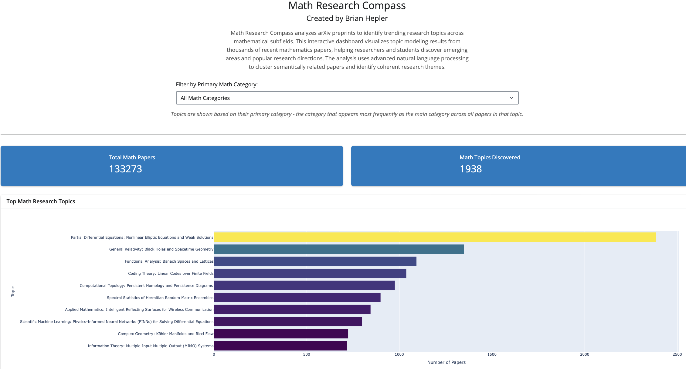

# Math Research Compass


## Overview

Math Research Compass analyzes arXiv preprints to identify trending research topics across mathematical subfields. This interactive dashboard visualizes topic modeling results from thousands of recent mathematics papers, helping researchers and students discover emerging areas and popular research directions.

Visit the live dashboard: [Math Research Compass](https://brian-hepler-phd.shinyapps.io/mathresearchcompass/)



## Project Structure

- `app.py` - The Shiny dashboard application
- `category_distribution.py` - Analyzes the distribution of arXiv categories across topics
- `topic_trends_analyzer.py` - Performs topic modeling analysis on arXiv papers
- `topic_labeling.py` - Enhances topic labels using Claude AI
- `workflow.ipynb` - Complete data processing workflow documentation

## Data Processing Workflow

### 1. Data Collection and Filtering

The project uses data from the [Kaggle ArXiv dataset](https://www.kaggle.com/datasets/Cornell-University/arxiv), containing approximately 2.7 million arXiv papers. The dataset includes:

- `id`: ArXiv ID
- `submitter`: Paper submitter
- `authors`: Paper authors
- `title`: Paper title
- `comments`: Additional information (pages, figures)
- `journal-ref`: Journal publication information
- `doi`: Digital Object Identifier
- `abstract`: Paper abstract
- `categories`: arXiv categories/tags
- `versions`: Version history

We filter this dataset to focus exclusively on mathematics papers.

### 2. Topic Modeling with BERTopic

We use BERTopic to identify coherent research topics within the mathematics papers. The process:

1. Process abstracts and titles of papers
2. Create embeddings using Sentence-BERT
3. Apply dimensionality reduction using UMAP
4. Perform clustering with HDBSCAN
5. Extract representative keywords for each topic

This produces:
- Topic IDs (numerical labels)
- Topic counts (number of papers in each topic)
- Topic names (generated from keywords)
- Representative keywords for each topic
- Representative documents for each topic

### 3. Merging Document-Topic Assignments

Each paper is matched with its assigned topic, creating a dataset that links paper metadata with topic assignments.

### 4. Enhancing Topic Labels with Claude

The raw topic labels from BERTopic are improved using Claude (Anthropic's LLM) to generate more descriptive and human-readable topic labels. Claude is prompted with:
- The list of top keywords for each topic
- The mathematical subject areas
- A request to generate both a concise and detailed descriptive label

This produces two labels for each topic:
1. A concise label (3-5 words)
2. A descriptive label specifying the mathematical subfield

### 5. Creating the Final Dataset

All components are merged to create a comprehensive dataset containing papers with their topic assignments and enhanced labels.

### 6. Preparing Data for Visualization

A summary dataset is created for the dashboard visualization, focusing on the key details needed for interactive exploration.

### 7. Category Distribution Analysis

The final processing step calculates the distribution of arXiv categories within each topic and determines the primary category for each topic:

1. Calculating the frequency of each arXiv category within each topic
2. Creating a dictionary mapping topics to their category distributions
3. Determining the primary category for each topic (most frequent category)
4. Updating the dataset with the primary_category column

The final dataset includes:
- `topic`: numerical topic ID
- `count`: number of papers in the topic
- `descriptive_label`: human-readable topic description
- `primary_category`: the most common arXiv category in that topic

## Usage

### Installation

```bash
# Clone the repository
git clone https://github.com/yourusername/math-research-compass.git
cd math-research-compass

# Install requirements
pip install -r requirements.txt
```

### Running the Dashboard

```bash
# Launch the Shiny app
python app.py
```

Visit https://brian-hepler-phd.shinyapps.io/mathresearchcompass/ in your browser to view the dashboard.

### Reproducing the Analysis

To recreate the topic modeling analysis from scratch:

```bash
# Run the topic modeling analysis
python topic_trends_analyzer.py --custom-csv data/cleaned/math_arxiv_snapshot.csv --years 5

# Enhance topic labels with Claude AI
export ANTHROPIC_API_KEY=your_claude_api_key
python topic_labeling.py

# Calculate category distributions
python category_distribution.py
```

## Features

- Interactive visualization of mathematical research topics
- Filtering by mathematical subfields (31 arXiv math categories)
- Display of top research topics by paper count
- Topic breakdown by primary mathematical category
- Summary statistics for papers and topics

## Technologies

- **BERTopic**: Advanced topic modeling combining BERT embeddings with clustering
- **Sentence-BERT**: Generating semantically meaningful embeddings
- **UMAP & HDBSCAN**: Dimensionality reduction and clustering
- **Claude AI**: Enhanced topic labeling and interpretation
- **Shiny for Python**: Interactive web dashboard
- **Plotly**: Interactive data visualizations
- **Pandas & NumPy**: Data processing and analysis

## License

This project is licensed under the MIT License - see the LICENSE file for details.

## Acknowledgments

- ArXiv for providing access to research paper metadata
- Kaggle for hosting the ArXiv dataset
- Anthropic for the Claude API used in topic labeling
